## This project demonstrates how to build a lightweight API using:

- ASP.NET Core Minimal APIs
- Custom Middleware (Logging & Exception Handling)
- Dependency Injection (DI)
- Modular Endpoint Structure
- Simple In-Memory Data Handling

`ExceptionMiddleware.cs` 

